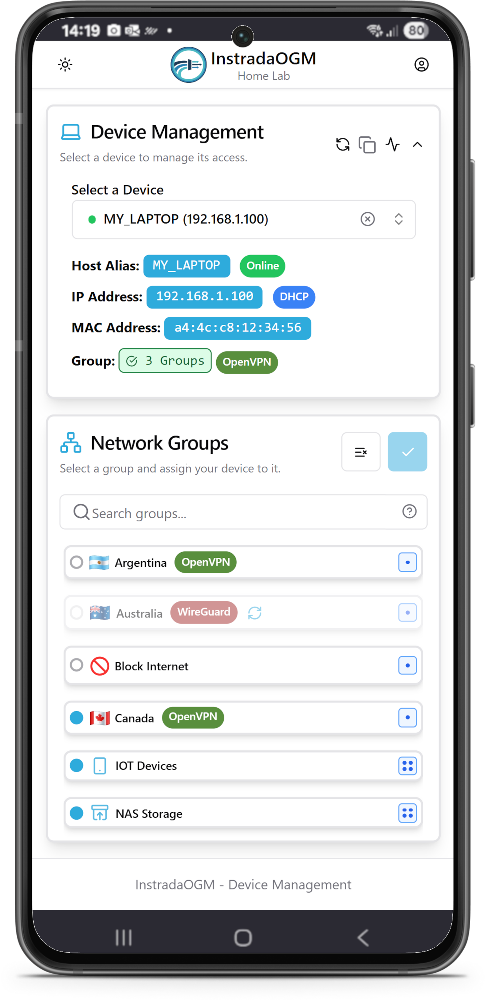
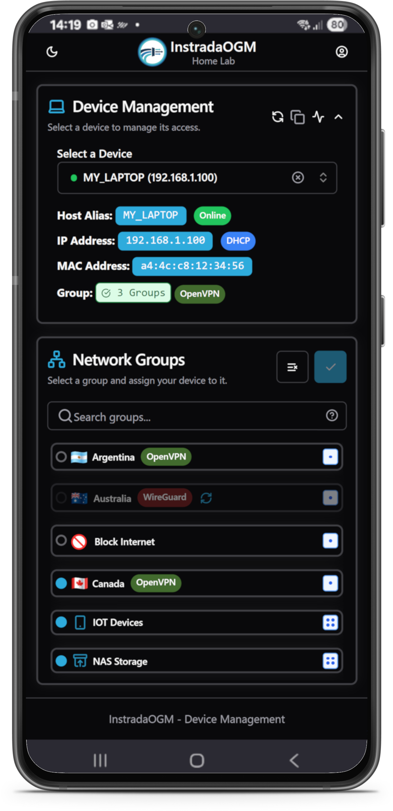
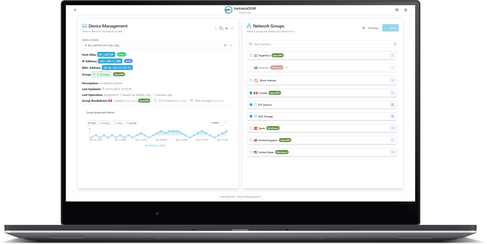
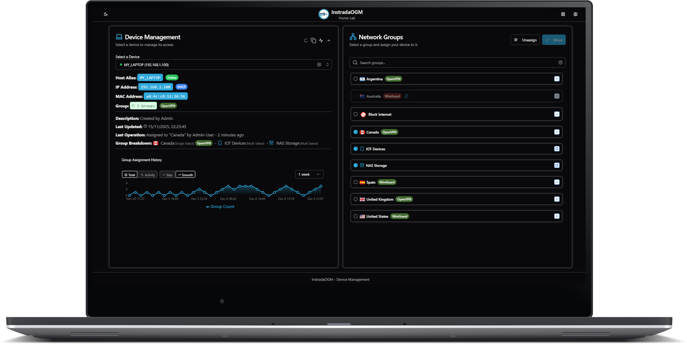

<div align="center">
  
  <h1>InstradaOGM</h1>  
  <p><em>"Open Group Manager" for OPNsense Firewalls</em></p>
</div>

<div align="center">
  <h3><a href="#quick-start">🚀 Jump to Quick Start Guide</a></h3>

[](https://opnsense.org)
[](https://hub.docker.com)
[](https://traefik.io/)
[](https://www.typescriptlang.org)
[](https://nextjs.org)
[](https://next-auth.js.org)
[](https://nodejs.org/en)
[](https://react.dev/)
[](https://lucide.dev/)
[](https://www.npmjs.com/)
[](https://tailwindcss.com/)
[](https://www.prisma.io)
[](https://www.sqlite.org/index.html)
[](https://www.postgresql.org)
[](https://openvpn.net)
[](https://wireguard.com)
[](https://en.wikipedia.org/wiki/IPsec)
[](https://kea.readthedocs.io/en/latest/)
[](https://openid.net/connect/)
[](https://goauthentik.io)
[](https://www.microsoft.com/en-gb/security/business/identity-access/microsoft-entra-id)
[](https://www.keycloak.org)
[](LICENSE)
</div>

## 📄 Disclaimer

InstradaOGM is a third-party tool and is **not affiliated with, endorsed by, or connected to [Deciso B.V.](https://deciso.com/)** (the company behind [OPNsense](https://opnsense.org/)). OPNsense is a registered trademark of Deciso B.V.

<h2>🚀 What is InstradaOGM?</h2>

**Instrada(OGM)** is a modern, web-based application that transforms how you manage network access control on OPNsense firewalls. Instead of manually configuring firewall rules, simply add or remove devices from predefined network groups to instantly control their Internet access, VPN routing, and network policies.

### ✨ Key Benefits
- **🎯 One-Click Network Control**: Instantly change device network access without touching firewall rules
- **🌐 VPN-Free Routing**: Route devices through different VPNs without installing VPN clients on each device
- **📱 Self-Service Portal**: Users can manage their own device access from any browser
- **🔄 Real-Time Changes**: Network policy changes take effect immediately
- **🛡️ Security First**: Role-based access control with comprehensive audit logging

---

## 📱💻 Screenshots

<div align="center">

### 📱 Mobile Interface
</br>


  
### 💻 Desktop Interface
</br>



</div>

---

## 📱 Install as PWA

InstradaOGM is a Progressive Web App — it can be installed directly from your browser for a full-screen, native-like experience.

- **Android (Chrome)**: Tap the menu (⋮) → "Add to Home screen" → Install
- **iOS (Safari)**: Tap Share → "Add to Home Screen" → Add
- **Desktop (Chrome/Edge)**: Click the install icon (⊕) in the address bar → Install

Requires HTTPS access. Once installed, the app runs in its own window, separate from your browser.

---

## 🎯 Perfect For

### 🏠 **Home Lab Enthusiasts**
- **Easy Network Changes**: Dynamically change network policies as needs evolve on a per group basis without touching firewall rules
- **Smart Home Management**: Easily segment IoT devices into secure network zones
- **Family Network Control**: Manage kids' device access with parental controls (while connected to the home network)
- **Guest Network Management**: Quickly assign guest devices to appropriate access levels
- **Personal VPN Routing**: Route different devices through different VPN connections
- **Devices Can Manage Devices**: Allow devices to change other devices network access through the use of API key
- **Granual Device Access Priviledges**: Give access to your Users and associated named API keys
- **Monitoring and Auditing of Changes**: Extensive monitoring and analytics for any activity

### 🧪 **Developers & Technical Users**
- **Multi-Region Testing**: Test applications from different geographic locations using VPN routing (Especially useful on devices that don't support VPN client apps)
- **Environment Isolation**: Isolate development, staging, and production device access
- **CI/CD Integration**: Automate network policy changes in deployment pipelines
- **API Testing**: Comprehensive REST API for automation and integration
- **Device Simulation**: Quickly switch device network contexts for testing scenarios

> [!NOTE]
> **Security Architecture**: This software manages firewall policies mostly through group memberships. Overall network security depends on your underlying network design, hardware capabilities, firewall configuration and security policies. 
InstradaOGM provides the management layer—you need the configure the underlying rules in OPNsense.

---

## 🌟 Core Features

### 🏠 **Self-Service Portal**
Transform how users interact with your network. The self-service dashboard automatically detects the user's device and provides instant network control.

**Security Considerations**: where security is paramount this can be completely disabled (see [Global Self-Service Disable](docs/FEATURES/GLOBAL_SELF_SERVICE_DISABLE.md))

**Key Capabilities:**
- **🔍 Automatic Device Detection**: Detects IP, MAC address, hostname, and vendor information
- **👆 One-Click Group Assignment/Move**: Join, Move or Leave network groups instantly
- **📊 Real-Time Status**: View current group memberships and VPN connection status
- **📈 Assignment History Graph**: Visual timeline of your device's group membership changes with automatic refresh
- **🔒 DHCP Integration**: Shows DHCP reservation status, detects IP/MAC conflicts, and warns about privacy/randomized MAC addresses
- **📱 Mobile Optimized**: Full functionality on phones, tablets, and desktops
- **🛡️ IP Validation**: Secure self-service with automatic client IP validation

### 💻 **Multi-Device Management**
Comprehensive device management for administrators and authorized users.

**Advanced Features:**
- **🎛️ Bulk Operations**: Manage multiple devices across network groups simultaneously
- **🔍 Smart Search**: Searchable device lists with real-time filtering
- **✏️ Smart Device Renaming**: Rename host aliases with automatic DHCP reservation offers for online devices and MAC randomization warnings
- **👥 Permission-Based Access**: Users only see devices they're authorized to manage
- **⚠️ Conflict Detection**: Automatic detection of IP and MAC address conflicts, plus privacy MAC randomization warnings
- **📈 Status Indicators**: Visual indicators for device status and connectivity
- **📊 Assignment History**: Interactive graph showing group membership changes over time with configurable time periods

### 🔧 **Administrative Control**
Full administrative interface for managing the entire system.

**Management Capabilities:**
- **🌐 Network Groups**: Create and manage OPNsense network groups with custom icons
- **🎯 Group Types**: Configure SingleSelect and MultiSelect group behaviors for advanced assignment control
- **🏷️ Host Aliases**: Complete CRUD operations for OPNsense host aliases
- **🖥️ DHCP Management**: View and manage DHCP reservations with automatic MAC randomization detection
- **👤 User Management**: Local user accounts with role-based permissions (USER, ADMIN, SUPER_ADMIN)
- [🔗 SSO Integration](docs/CONFIGURATION/SSO_PROVIDER_CONFIG.md): Map external SSO groups to local groups automatically
- [📋 Audit Logging](docs/api/api_docs/25_audit_log_management_endpoints.md): Comprehensive audit trail with filtering, search, and retention management
- [🔄 Update Detection](docs/api/api_docs/31_update_endpoints.md): Automatic update checks (configurable via AUTO_UPDATE_CHECK) with changelog previews and manual check support

### ⚙️ **System Configuration**
Flexible configuration options for different deployment scenarios.

**Configuration Options:**
- **🌍 Global Settings**: Application-wide settings and self-service controls
- **🏷️ Application Subtitle**: Custom subtitle display for instance identification
- **🔒 Security Controls**: Global self-service disable for enhanced security in less secure deployments
  - **Complete Self-Service Removal**: Disable all self-service functionality with automatic redirects
  - **API Security**: Automatically disables unauthenticated APIs when self-service is disabled
  - **Menu Updates**: Requires page refresh to update navigation and routing behavior
- **🎛️ Group Type Management**: Configure SingleSelect vs MultiSelect group behaviors with granular control
- **👁️ Display Filters**: Control network group visibility by user role
- **🔗 VPN Mappings**: Map network groups to VPN connections for routing control
- **🔐 SSO Providers**: Support for Authentik, Keycloak, Microsoft Entra ID
- **💾 Backup & Restore**: Encrypted backup system with restore capabilities
- **🔑 API Key Management**: Generate and manage API keys with rate limiting and usage analytics

### 📊 **Monitoring & Status**
Real-time monitoring and status information across your network.

**Monitoring Features:**
- **🌐 VPN Status Monitoring**: Real-time OpenVPN, WireGuard, and IPSec status
- **📈 System Summary**: Overview of users, devices, groups, and system health
- **🎯 Group Status**: Visual indicators for group membership and VPN connectivity
- **⚠️ Conflict Detection**: Automatic detection and alerting for network conflicts
- **🏷️ Status Badges**: Color-coded indicators for quick visual assessment
- **📊 Group Assignment History**: Interactive timeline graphs showing device group membership changes over time
  - **Visual Timeline**: Area chart visualization of group assignments with configurable time periods (1 week, 1 month, 3 months, 6 months, 1 year)
  - **Real-Time Updates**: Graphs automatically refresh after group assignment operations
  - **Self-Service Integration**: Available on both Device Management and Self-Service pages
  - **Audit Trail Visualization**: Graphical representation of audit log data for easy pattern recognition

### ⏰ **Scheduled Assignments**
Automate network group changes on a time-based schedule — without manual intervention.

**Key Capabilities:**
- **📅 Three Scheduling Modes**: Complex Weekly (visual 7-day grid with per-day time windows), Once (fire-and-forget), and Recurring (cron expression)
- **⚡ Automated Actions**: ASSIGN, UNASSIGN, and CLEAR_ALL operations with group-type-aware logic
- **🕐 Timezone Support**: Full IANA timezone support with correct DST handling
- **🎯 Flexible Targeting**: Target OPNsense host aliases (UI), static IP lists, or entire network groups (API)
- **📊 Execution History**: Paginated log of past executions with per-action, per-IP results and status
- **🔍 Dry-Run Evaluation**: Preview exactly what would fire at any date/time before enabling a schedule

**Use Cases:**
- "Block internet access on kids' devices every school night at 9 PM, restore at 7 AM"
- "Move devices to the weekend VPN group every Friday at 5 PM"
- "Temporarily block a device during tomorrow's exam, fire-and-forget"

**Related Documentation:**
- **[📖 Scheduled Assignments Guide](docs/FEATURES/SCHEDULED_ASSIGNMENTS.md)** - Complete feature and UI walkthrough
- **[🔌 Schedule API Reference](docs/api/api_docs/32_schedule_endpoints.md)** - Full API documentation with examples

---

### 🔍 **MAC Address Tracking**
Advanced network device discovery and monitoring through automated ARP table scanning.

**Key Capabilities:**
- **🔄 Automated Discovery**: Periodic ARP table scans to discover and track network devices
- **🔒 Privacy MAC Detection**: Automatic identification of randomized MAC addresses used by modern devices
- **🚫 Advanced MAC Exclusion**: Filter out specific MAC addresses from mac address tracking (arp scanning)
  - **Targeted Exclusions**: Exclude specific devices like network infrastructure, virtual machines, or unwanted devices
  - **Automatic Detection**: Smart identification of devices that should typically be excluded (VRRP, HSRP, etc.)
  - **Partial Exclusion**: Track IPs with no detailed history (Avoids flapping history)
  - **Full Exclusion**: Completely skip MAC during ARP scanning
- **📋 DHCP Integration**: Cross-reference MAC addresses with DHCP reservations for comprehensive device tracking
- **📊 Device Analytics**: Track device online/offline status, first seen dates, and activity patterns
- **🎯 Vendor Identification**: Automatic MAC vendor lookup using OPNsense primarily and fallback to comprehensive OUI database (37,000+ entries)
- **📱 Mobile-Responsive Interface**: Full-featured device tracking on desktop and mobile devices
- **🔐 Role-Based Access**: Granular permissions with ADMIN (read-only) and SUPER_ADMIN (full control) access
- **📈 Historical Tracking**: Complete history of MAC/IP associations with timeline views
- **🔍 Advanced Search**: Powerful search with special keywords (dhcp:, privacy:, online:, offline:, interface:, excluded:)
- **📤 Data Export**: Export tracking data in multiple formats for analysis and reporting

**Related Documentation:**
- **[📖 MAC Address Tracking Guide](docs/FEATURES/MAC_ADDRESS_TRACKING.md)** - Complete feature documentation


### 🔐 **Security & Authentication**
Enterprise-grade security with flexible authentication options.

**Security Features:**
- **🔑 Multiple Auth Methods**: Local authentication and multiple SSO providers
- **📱 Two-Factor Authentication**: Built-in TOTP 2FA with secure backup codes for account recovery
- **🔐 Backup Codes**: 10 single-use recovery codes for 2FA when authenticator is unavailable
- **👥 Role-Based Access**: Granular permissions with three user roles
- **🕒 Session Management**: Secure sessions with automatic timeout
- **🔍 Audit Logging**: Complete audit trail for compliance and security
- **🛡️ API Security**: Rate-limited API keys with configurable permissions and usage tracking

### 🔒 **Global Self-Service Disable**
Enhanced security feature for environments that don't require self-service functionality.

**Security Benefits:**
- **🚫 Complete Removal**: Disables all self-service functionality at the application level
- **🔄 Automatic Redirects**: Authenticated users are redirected to device management instead of self-service
- **🛡️ API Protection**: Automatically disables unauthenticated APIs (`/api/opnsense/ip-group-membership`)
- **🎯 Targeted Security**: Reduces attack surface for deployments that only need admin-managed access

**Use Cases:**
- **🏢 Corporate Environments**: Where only IT administrators should manage network access
- **🔐 High-Security Deployments**: Minimize exposed functionality and potential attack vectors
- **🎓 Educational Institutions**: Where network access is centrally controlled

**Implementation:**
- **⚙️ Global Setting**: `removeSelfServicePage` in Global Settings (SUPER_ADMIN only)
- **🔄 Refresh Required**: Page refresh needed after toggle to update menu and routing
- **🛡️ Server-Side Enforcement**: Redirects handled server-side before any client components load
- **📱 Mobile Friendly**: Works seamlessly across all device types and screen sizes (limited support for very small phone screens)

---

## 🎯 **Advanced Group Types: SingleSelect & MultiSelect**

InstradaOGM introduces sophisticated group assignment behaviors that give administrators fine-grained control over how devices can be assigned to network groups.

### 🔄 **Smart Assignment Logic**

#### **🔴 SingleSelect Groups**
- **Behavior**: Devices can only be in **one** SingleSelect group at a time
- **Assignment**: Moving to a new SingleSelect group automatically removes the device from other SingleSelect groups
- **Use Cases**: VPN routing (device can only use one VPN), access levels (guest/user/admin), location-based groups
- **Example**: Moving from "VPN-US" to "VPN-EU" automatically removes "VPN-US" membership

#### **🟢 MultiSelect Groups**
- **Behavior**: Devices can be in **multiple** MultiSelect groups simultaneously
- **Assignment**: Adding to MultiSelect groups is always additive (no automatic removal)
- **Use Cases**: Service access (email, file sharing, printing), security groups, feature flags
- **Example**: Adding to "Email Access" doesn't affect existing "File Server" or "Printer Access" memberships

#### **🧠 Intelligent Preservation**
- **Smart Moves**: SingleSelect assignments preserve existing MultiSelect memberships
- **Group Isolation**: MultiSelect and SingleSelect groups operate independently
- **Move-Only Support**: Disable group types for traditional "replace all" behavior

### ⚙️ **Flexible Configuration**

#### **🔐 Role-Based Access**

**Important**: Group type functionality is available to **all authenticated users** (USER, ADMIN, SUPER_ADMIN) with device permissions. Only **SUPER_ADMIN** can configure global group type settings.

#### **🎛️ Three Deployment Modes**

| Mode | Settings | Behaviour |
|------|----------|-----------|
| **Move-Only** | `enableGroupTypes: false` | All groups act as SingleSelect — assigning always evicts from all other groups. Simple and predictable. |
| **Device Management** | `enableGroupTypes: true`, `enableSelfServiceMultiSelect: false` | Full SingleSelect/MultiSelect logic in Device Management; self-service users see only SingleSelect groups. |
| **Full** | `enableGroupTypes: true`, `enableSelfServiceMultiSelect: true` | Both group types available everywhere. Best for power users and advanced deployments. |

### 🎨 **Visual Indicators & Customization**

- **📍 Group Type Icons**: Visual indicators for SingleSelect (•) vs MultiSelect (⋯) groups
- **🎨 Custom Branding**: Configurable names and icons for group types
- **🔄 Real-Time Updates**: Settings changes propagate instantly across all interfaces
- **📱 Responsive Design**: Full functionality on mobile and desktop

### ✨ **Custom Symbols**
Advanced visual customization system for network groups and interface elements.

**Symbol Types:**
- **🎯 Lucide Icons**: 1000+ professional vector icons from the Lucide library
- **😀 Custom Emojis**: Standard Unicode emojis for visual identification
- **🏳️ Flag Emojis**: Regional indicator symbols for geographic or organizational identification

**Key Features:**
- **🔍 Smart Search**: Searchable icon picker with real-time filtering
- **📋 Easy Management**: Add, edit, and delete custom symbols through admin interface
- **🎨 Visual Preview**: Live preview of symbols in network group displays
- **📱 Cross-Platform**: Consistent symbol rendering across desktop and mobile
- **🔗 Integration**: Seamless integration with network group management and icon pickers

### 📚 **Comprehensive Documentation**

**[📖 Complete SingleSelect & MultiSelect Documentation](docs/FEATURES/SINGLE_SELECT_MULTI_SELECT_FEATURE.md)**

Detailed technical documentation covering:
- Database schema changes and migrations
- Assignment logic implementation details
- UI component adaptations
- API endpoint enhancements
- Testing scenarios and examples
- Performance considerations

---

## 🏷️ **Smart Device Renaming with DHCP Integration**

InstradaOGM provides intelligent device renaming that goes beyond simple name changes, offering automatic DHCP reservation creation (if a device is online) and MAC randomization detection.

### 🧠 **Intelligent DHCP Reservation Offers**

When renaming devices, InstadaOGM automatically detects optimal conditions for DHCP reservations:

#### **✅ Automatic DHCP Reservation Offer**
- **Online Device Detection**: Automatically offers DHCP reservation when device has active ARP entry
- **Smart Defaults**: Pre-selects DHCP reservation creation for online devices without existing reservations
- **One-Click Setup**: Create both the new device name and DHCP reservation in a single operation
- **Permission-Aware**: Only offers reservations for IPs the user is allowed to manage

#### **⚠️ MAC Randomization Detection & Warnings**
- **Privacy MAC Detection**: Automatically identifies when devices use randomized MAC addresses
- **Clear Warnings**: Explains why DHCP reservations may fail with randomized MACs
- **Educational Guidance**: Provides step-by-step instructions to disable MAC randomization
- **Confidence Levels**: Shows detection confidence (high/medium/low) for transparency

#### **🔍 Offline Device Protection**
- **Dynamic IP Warnings**: Warns when renaming offline devices that may get different IPs
- **Static IP Detection**: Allows renaming when users confirm static IP configuration
- **Risk Assessment**: Clear explanations of potential name/IP mismatches

### 📚 **Related Documentation**
- **[🛡️ MAC Randomization Guide](docs/FEATURES/MAC_RANDOMIZATION_GUIDE.md)** - Complete guide to understanding and managing MAC address randomization
- **[📖 DHCP Reservations Documentation](docs/CONFIGURATION/DHCP_RESERVATIONS.md)** - Comprehensive guide to DHCP reservation system and integration
- **[🌐 Traefik Proxy Settings](docs/CONFIGURATION/TRAEFIK-PROXY-SETTINGS.md)** - **REQUIRED** configuration for Traefik reverse proxy (Recommended)
- **[🌐 NGINX Proxy Settings](docs/CONFIGURATION/NGINX-PROXY-SETTINGS.md)** - **REQUIRED** configuration for proper IP detection when using reverse proxies
- **[🌐 Caddy Proxy Settings](docs/CONFIGURATION/CADDY-PROXY-SETTINGS.md)** - **REQUIRED** configuration for Caddy reverse proxy

---

## 🔧 How It Works

### 🎯 **The Magic Behind InstradaOGM**

InstradaOGM works by leveraging OPNsense's existing network group functionality and making it accessible through a modern web interface. Here's how it transforms network management:

#### **Traditional Approach** ❌
```
Device needs VPN access → Edit firewall rules → Apply configuration → Test → Repeat for each device
```

#### **InstradaOGM Approach** ✅
```
Device needs VPN access → Click "Join VPN Group" → Done! (Instant network policy change). Rules need to be created in OPNsense in advance and associated to the groups, InstadaOGM manages the group membership not the rules (at least not yet).
```

### 🔄 **Core Integration Points**

#### **1. OPNsense Host Aliases**
- Devices are represented as OPNsense host aliases (IP + friendly name)
- Automatic hostname detection from network ARP tables
- Support for manual device naming and descriptions
- Real-time synchronization with OPNsense configuration

#### **2. Network Groups**
- Leverage existing OPNsense network groups for policy control
- Custom friendly names and icons for user-friendly interface
- Group-based permissions for user access control
- Real-time group membership management

#### **3. VPN Integration**
- Monitor OpenVPN, WireGuard, and IPSec connection status
- Map network groups to specific VPN connections
- Automatic routing based on group membership
- No VPN client software required on devices

#### **4. Policy Enforcement**
- Changes take effect immediately through OPNsense API
- Existing firewall rules determine actual network access
- Group membership controls which rules apply to each device
- Complete audit trail for all changes

### 🛠️ **Technical Architecture**

#### **Frontend** (Next.js 15 + TypeScript)
- Modern React-based web interface
- Responsive design for mobile and desktop
- Real-time updates and status monitoring
- Accessible UI components with Tailwind CSS

#### **Backend** (Next.js API Routes + Prisma)
- RESTful API with ~120 endpoints
- Direct OPNsense API integration
- Role-based access control
- Comprehensive audit logging

#### **Database** (SQLite/PostgreSQL)
- User accounts and permissions
- Device-to-group mappings
- Audit logs and system configuration
- Backup and restore capabilities

#### **Authentication** (NextAuth.js)
- Local user accounts with 2FA support and backup codes
- Multiple SSO providers (Authentik, Microsoft Entra ID, Keycloak)
- API key authentication for automation
- Session management with automatic timeout

---

## 🌐 **Reverse Proxy Setup (Required)**

InstradaOGM requires a reverse proxy for production deployments to handle:
- **HTTPS/SSL termination** with automatic certificates
- **Proper client IP forwarding** for security and access control
- **HTTP to HTTPS redirects** for security enforcement

### 🚀 **Traefik - Recommended Reverse Proxy**

**Traefik is the recommended reverse proxy for InstradaOGM** due to its seamless Docker integration and automatic SSL certificate management.

#### ✅ **Why Traefik is Recommended**
- **🔒 Automatic HTTPS**: Let's Encrypt certificates with auto-renewal
- **🌍 DNS Challenge Support**: Works behind firewalls using any DNS provider
- **🐳 Docker Integration**: Automatic service discovery and configuration
- **🔄 Zero Downtime**: Hot-reload configuration without restarts
- **📊 Built-in Dashboard**: Monitor traffic and configuration
- **🛡️ Security First**: Proper IP forwarding and header management
- **⚡ High Performance**: Optimized for containerized environments

#### 🚀 **Quick Traefik Setup**
```bash
# 1. Configure domain in main .env
echo "NEXTAUTH_URL=\"https://your-instrada-ogm.com\"" >> .env
echo "DOMAIN=your-instrada-ogm.com" >> .env

# 2. Configure Traefik
cd traefik && ./generate-config.sh

# 3. Edit traefik/runtime/.env.traefik
# DOMAIN=your-instrada-ogm.com
# DNS_PROVIDER=cloudflare
# CLOUDFLARE_DNS_API_TOKEN=your_token
# LETSENCRYPT_EMAIL=your-email@example.com
# ACME_SERVER=staging  # Change to production after testing

# 4. Generate and validate
./generate-config.sh && ./validate.sh

# 5. Start services
cd .. && docker-compose -f docker-compose-traefik.yml --profile sqlite up -d
```

#### 📚 **Complete Traefik Documentation**
- **[🌐 Traefik Proxy Settings](docs/CONFIGURATION/TRAEFIK-PROXY-SETTINGS.md)** - Complete setup guide with 150+ DNS providers
- **[🔧 Traefik Configuration](traefik/)** - Template-based configuration system
- **[📊 Traefik Dashboard](http://localhost:8080/dashboard/)** - Monitor your reverse proxy (local access only)

### 🔧 **Alternative Reverse Proxies**

While Traefik is recommended, InstradaOGM also supports:

#### **NGINX**
- Traditional reverse proxy with extensive configuration options
- Manual SSL certificate management required (unless you use npm -> nginx-proxy-manager)
- **[NGINX Configuration Guide](docs/CONFIGURATION/NGINX-PROXY-SETTINGS.md)**

#### **Caddy** (Documentation Not Tested Yet)
- Simple configuration with automatic HTTPS
- Limited DNS provider support compared to Traefik
- **[Caddy Configuration Guide](docs/CONFIGURATION/CADDY-PROXY-SETTINGS.md)** (Guide Not Tested)

---

<div id="quick-start"></div>
## 🚀 Quick Start

Get InstradaOGM up and running in minutes! Choose the deployment method that best fits your needs:

### ⚡ **Option 1: One-Line Install Script** (Fastest - Linux/WSL Only)

**Perfect for:** Quick testing, home labs, and getting started fast with SQLite

Run this single command on any Linux system or Windows WSL:

```bash
sudo bash -c "$(curl -fsSL https://raw.githubusercontent.com/rdeangel/InstradaOGM/refs/heads/main/scripts/install-instradaogm.sh)"
```

**What it does:**
- ✅ Automatically installs all dependencies (Node.js v23, SQLite, etc.)
- ✅ Downloads and installs the latest InstradaOGM release
- ✅ Sets up systemd service for automatic startup
- ✅ Guides you through OPNsense API configuration
- ✅ Starts InstradaOGM immediately at `http://YOUR_SERVER_IP:3000`

**Requirements:**
- Linux system (Debian/Ubuntu/RHEL-based) or Windows WSL
- Root/sudo privileges
- Internet connection

**Available Commands:**
```bash
# Install latest version
sudo ./install-instradaogm.sh --latest

# Update to latest version
sudo ./install-instradaogm.sh --update

# Reinstall (repair) current version
sudo ./install-instradaogm.sh --reinstall

# Uninstall completely
sudo ./install-instradaogm.sh --uninstall

# Clean up old backups
sudo ./install-instradaogm.sh --clean-backups

# Get help
sudo ./install-instradaogm.sh --help
```

> [!NOTE]
> This method uses SQLite and is ideal for testing and home labs. For production deployments with multiple users, consider Docker with PostgreSQL below.

---

### 🐳 **Option 2: Docker Deployment** (Recommended for Production)

**Perfect for:** Production environments, scalability, and enterprise deployments

We have created comprehensive, step-by-step guides for deploying InstradaOGM with Docker:

#### 🏠 [SQLite Deployment (Recommended for Home/Small Labs)](docs/DEPLOYMENT/DOCKER_DEPLOYMENT_SQLITE.md)
**Best for:** Home labs, testing, and small deployments (< 10 users).
- ✅ Zero configuration required
- ✅ Simple file-based database
- ✅ Minimal resource usage
- ✅ Easy backup and migration
- [**View SQLite Guide →**](docs/DEPLOYMENT/DOCKER_DEPLOYMENT_SQLITE.md)

#### 🏢 [PostgreSQL Deployment (Recommended for Production)](docs/DEPLOYMENT/DOCKER_DEPLOYMENT_POSTGRES.md)
**Best for:** Production environments, businesses, and high-traffic setups.
- ✅ High performance & concurrency
- ✅ Enterprise-grade reliability
- ✅ Advanced database features
- ✅ Standard database tools
- [**View PostgreSQL Guide →**](docs/DEPLOYMENT/DOCKER_DEPLOYMENT_POSTGRES.md)

> [!TIP]
> Both guides include complete instructions for **HTTP** (local development/home labs) and **HTTPS** (production with Traefik) deployments.

#### 📄 [Deployment Overview & Decision Guide](docs/DEPLOYMENT/README.md)
Not sure which one to pick? Check out our [Deployment Overview](docs/DEPLOYMENT/README.md) for a detailed comparison.

---

### 📋 **Prerequisites** (All Methods)

Before installing InstradaOGM, ensure you have:

- **🔥 OPNsense Firewall**: Version 23.1+ (preferred v25.1+) with API access enabled
- **🔑 OPNsense API Credentials**: API key and secret (System > Access > Users > API Keys)
  
  <details>
  <summary><strong>📋 Required OPNsense API Permissions (Click to expand)</strong></summary>
  
  The API user in OPNsense must have the following page permissions for InstradaOGM to function properly:
  
  **Diagnostics:**
  - `page-diagnostics-arptable` - ARP table access for device discovery
  
  **Firewall & Aliases:**
  - `page-firewall-alias-edit` - Edit host aliases and network groups
  - `page-firewall-aliases` - View and manage firewall aliases
  
  **DHCP:**
  - `page-dhcp-kea-v4` - Kea DHCP server management
  
  **Network Status:**
  - `page-status-interfaces` - Interface status monitoring
  
  **IPsec VPN:**
  - `page-status-ipsec` - IPsec connection status
  - `page-status-ipsec-leases` - IPsec lease information
  - `page-status-ipsec-sad` - IPsec Security Association Database
  - `page-status-ipsec-spd` - IPsec Security Policy Database
  - `page-status-systemlogs-ipsecvpn` - IPsec VPN logs
  - `page-vpn-ipsec-connections` - IPsec connection management
  - `page-vpn-ipsec-editkeys` - IPsec key editing
  - `page-vpn-ipsec-keypairs` - IPsec key pair management
  
  **OpenVPN:**
  - `page-status-openvpn` - OpenVPN connection status
  - `page-status-systemlogs-openvpn` - OpenVPN logs
  - `page-openvpn-client-export` - OpenVPN client configuration
  - `page-openvpn-csc` - OpenVPN client-specific overrides
  - `page-openvpn-instances` - OpenVPN instance management
  
  **WireGuard:**
  - `page-wireguard-config` - WireGuard configuration
  - `page-wireguard-logs` - WireGuard logs
  - `page-wireguard-diagnostics` - WireGuard diagnostics
  
  **Configuration:** Navigate to **System > Access > Users** in OPNsense, edit your API user, and grant these page permissions under the **Effective Privileges** section.
  </details>

- **🌐 Network Access**: Application must be able to reach your OPNsense firewall
- **📡 Network Groups**: OPNsense Pre-configured network groups and firewall rules

## 🔧 Development & Customization

### 🏗️ **Local Development**

Want to contribute or customize InstradaOGM? Set up a local development environment:

```bash
# Install dependencies
npm install

# Setup development environment
npm run setup-dirs

# Generate Prisma client
npm run prisma:generate

# Start development server
npm run dev

# Run linter
npm run lint # (eslint .)

# Run TypeScript type checker
npm run type-check:pretty # (tsc --noEmit --pretty)
```

**📚 Development Documentation:**
- **[🚀 Installation Guide](docs/SETUP/INSTALLATION_GUIDE.md)** - Complete setup guide for new machines with utilities and Docker
- **[⚙️ Environment Setup](docs/SETUP/ENVIRONMENT_SETUP_GUIDE.md)** - Complete setup guide

### 🐳 **Custom Docker Builds**

Build your own Docker images with version information:

#### **Using NPM Scripts (Recommended)**

All npm scripts automatically extract the version from `package.json`:

**Build Commands:**
```bash
npm run docker:build:postgres            # Build PostgreSQL version
npm run docker:build:sqlite              # Build SQLite version
npm run docker:build-no-cache:postgres   # Build PostgreSQL without cache
npm run docker:build-no-cache:sqlite     # Build SQLite without cache
npm run docker:build-with-version        # Build both versions with versioning
```

**Start/Stop Commands:**
```bash
npm run docker:up:postgres           # Start PostgreSQL version
npm run docker:up:sqlite             # Start SQLite version
npm run docker:up:postgres:latest    # Start PostgreSQL (latest tag)
npm run docker:up:sqlite:latest      # Start SQLite (latest tag)
npm run docker:down:postgres         # Stop PostgreSQL version
npm run docker:down:sqlite           # Stop SQLite version
npm run docker:logs:postgres         # View PostgreSQL logs
npm run docker:logs:sqlite           # View SQLite logs
```

**Utility Commands:**
```bash
npm run docker:version               # Check current version
```

**Multi-Platform Build Commands:**
```bash
npm run docker:buildx:setup          # Setup buildx (one-time)
npm run docker:buildx:fix            # Fix buildx driver issues
npm run docker:buildx:postgres       # Build PostgreSQL for all platforms
npm run docker:buildx:sqlite         # Build SQLite for all platforms
npm run docker:buildx:all            # Build both for all platforms
npm run docker:buildx:push:postgres  # Build and push PostgreSQL
npm run docker:buildx:push:sqlite    # Build and push SQLite
npm run docker:buildx:push:all       # Build and push both
npm run docker:buildx:latest:postgres # Build PostgreSQL latest for all platforms
npm run docker:buildx:latest:sqlite  # Build SQLite latest for all platforms
npm run docker:buildx:latest:all     # Build both latest for all platforms
npm run docker:buildx:push:latest:postgres # Build and push PostgreSQL latest
npm run docker:buildx:push:latest:sqlite   # Build and push SQLite latest
npm run docker:buildx:push:latest:all      # Build and push both latest
```

#### **Using Docker Compose Directly**
```bash
# SQLite version
docker compose --profile sqlite build \
  --build-arg NEXT_PUBLIC_APP_VERSION=$(npm pkg get version --workspaces=false | tr -d '"')

# PostgreSQL version
docker compose --profile postgres build \
  --build-arg NEXT_PUBLIC_APP_VERSION=$(npm pkg get version --workspaces=false | tr -d '"')
```

#### **Using Environment Variable**
```bash
# Set version and build
NEXT_PUBLIC_APP_VERSION=$(node -p "require('./package.json').version") docker compose --profile postgres build
```

### 🌐 **Multi-Platform Support**

Both SQLite and PostgreSQL images support `linux/amd64` and `linux/arm64` (Apple Silicon, ARM servers). Use `npm run docker:buildx:*` scripts or `docker buildx build --platform linux/amd64,linux/arm64` directly.

### 📁 **Volume Management**

**SQLite Setup:**
- Database: `./data/db/`
- Backups: `./data/backups/`

**PostgreSQL Setup:**
- Database: `postgres_data` (named volume)
- Backups: `./data/backups/`

### 🏭 **Production Deployment**

For production deployments:

```bash
# Build the application
npm run build

# Start production server
npm start
```

---

## 🏗️ Technical Architecture

### 💻 **Modern Technology Stack**

**Frontend**
- **Next.js 15** - React framework with server-side rendering
- **React 18** - Modern React with concurrent features
- **TypeScript** - Type-safe development
- **Tailwind CSS** - Utility-first CSS framework
- **Radix UI** - Accessible component primitives

**Backend**
- **Next.js API Routes** - Serverless API endpoints
- **Prisma ORM** - Type-safe database access
- **NextAuth.js** - Authentication with multiple providers
- **bcryptjs** - Password hashing and security

**Database**
- **SQLite** - Lightweight, file-based database
- **PostgreSQL** - Production-ready relational database
- **Prisma Migrations** - Database schema management

**Infrastructure**
- **Docker** - Containerized deployment
- **Multi-stage builds** - Optimized container images
- **Health checks** - Container monitoring
- **Volume management** - Persistent data storage

### 🔧 **Core System Components**

#### **OPNsense Integration Layer**
- Direct API communication with OPNsense firewall
- Real-time host alias and network group management
- VPN status monitoring (OpenVPN, WireGuard, IPSec)
- DHCP reservation integration

#### **Device Management Engine**
- Automatic device detection and hostname resolution
- Bulk device operations with transaction support
- Conflict detection (IP/MAC address conflicts)
- Permission-based device access control

#### **Authentication & Authorization**
- Multi-provider SSO (Authentik, Microsoft Entra ID, Keycloak)
- Two-factor authentication with TOTP and secure backup codes
- 10 single-use backup codes for account recovery when TOTP is unavailable
- Role-based access control (USER, ADMIN, SUPER_ADMIN)
- API key management with rate limiting and comprehensive usage analytics

#### **Advanced Analytics & Monitoring System**
- **📈 API Usage Analytics**: Detailed API key usage statistics, trends, and rate limit monitoring
- **⚡ Real-Time Monitoring**: Live system activity, performance metrics, and user activity (5-second updates)
- **📊 Performance Analytics**: Response time analysis, endpoint performance, and P95/P99 metrics
- **🔍 Usage Trends**: Historical usage patterns and configurable time periods (up to 90 days)
- **📋 Comprehensive Audit Logging**: Activity logging, security auditing, and manual log trimming
- **🚨 Advanced Rate Limit Monitoring**: Track API usage with visual indicators and violation alerts
- **👥 User Activity Tracking**: Monitor active users, session activity, and system engagement
- **🎯 Endpoint Analytics**: Most popular endpoints, usage percentages, and performance bottlenecks
- **📱 Multi-Role Access**: User-specific analytics and admin system-wide monitoring
- Real-time VPN connection monitoring and system health tracking
- **💾 Encrypted Backup & Restore**: Full database backups with AES encryption, automated backup manager script with email notifications (supports Gmail, Outlook, local SMTP)

---

## 🔌 Comprehensive API

InstradaOGM provides a powerful REST API for automation, integration, and custom applications.

### 📊 **API Overview**
- **100+ Endpoints** covering all functionality including comprehensive analytics and monitoring
- **Role-Based Access** with USER, ADMIN, SUPER_ADMIN permissions and granular endpoint control
- **Multiple Authentication** methods (session, API keys, Bearer tokens) with usage tracking
- **Real-Time Integration** with immediate OPNsense policy changes and live monitoring
- **Advanced Analytics** with API key usage statistics, performance metrics, and real-time monitoring
- **Comprehensive Documentation** with curl examples, response samples, and integration guides

### 🚀 **Quick API Examples**

#### **Device Information**
```bash
# Get your current IP and device details
curl -X GET "https://your-instrada-ogm.com/api/ip"
```

#### **VPN Status Monitoring**
```bash
# Get public VPN status (no auth required)
curl -X GET "https://your-instrada-ogm.com/api/vpn/status"
```

#### **Device Group Management**
```bash
# Assign device to network group
curl -X POST "https://your-instrada-ogm.com/api/opnsense/host-group-management" \
  -H "Authorization: Bearer ${API_KEY}" \
  -H "Content-Type: application/json" \
  -d '{
    "operation": "assign",
    "ipAddress": "192.168.1.100",
    "groupFriendlyName": "VPN Users"
  }'
```

#### **Batch Operations**
```bash
# Manage multiple devices at once
curl -X POST "https://your-instrada-ogm.com/api/opnsense/host-group-management" \
  -H "Authorization: Bearer ${API_KEY}" \
  -H "Content-Type: application/json" \
  -d '{
    "operation": "batch",
    "operationType": "assign",
    "hostAliases": [
      {"ipAddress": "192.168.1.10"},
      {"hostname": "office-printer"}
    ],
    "groups": [{"groupFriendlyName": "Office Equipment"}]
  }'
```

#### **Analytics & Monitoring**
```bash
# Get API key usage statistics
curl -X GET "https://your-instrada-ogm.com/api/account/api-keys/your-key-id/usage?includeTrends=true" \
  -H "Authorization: Bearer ${API_KEY}"

# Get real-time system monitoring (Admin)
curl -X GET "https://your-instrada-ogm.com/api/admin/analytics/realtime" \
  -H "Authorization: Bearer ${ADMIN_API_KEY}"

# Get performance analytics (Admin)
curl -X GET "https://your-instrada-ogm.com/api/admin/api-keys/analytics/performance?startDate=2024-01-01T00:00:00Z&endDate=2024-01-31T23:59:59Z" \
  -H "Authorization: Bearer ${ADMIN_API_KEY}"
```

#### **Automated Backups**
```bash
# Create and download backup with email notification (Gmail)
./scripts/backup_manager.sh --delete-remote --email \
  --email-to admin@example.com \
  --email-from you@gmail.com \
  --smtp-server smtp.gmail.com \
  --smtp-port 587 \
  --smtp-user you@gmail.com \
  --smtp-pass your-app-password
```

📚 **[Complete Backup Automation Guide](docs/FEATURES/BACKUP_MANAGEMENT.md)** - Learn about scheduling, configuration, and all SMTP options (Gmail, Outlook, local relay)

---

## 📚 **Documentation Index**

### 📚 **Documentation Home**
- **[📖 Documentation Center](docs/DOCUMENTATION_INDEX.md)** - Complete documentation hub with navigation guides

### 🔧 **Setup & Installation**
- **[Installation Guide](docs/SETUP/INSTALLATION_GUIDE.md)** - Complete setup guide for new machines with utilities and Docker
- **[Environment Setup](docs/SETUP/ENVIRONMENT_SETUP_GUIDE.md)** - Development environment configuration
- **[Traefik Setup Guide](docs/SETUP/TRAEFIK_SETUP_GUIDE.md)** - Production setup with Traefik reverse proxy and HTTPS
- **[Database Configuration](docs/SETUP/DATABASE_CONFIGURATION_GUIDE.md)** - Database setup and configuration
- **[Docker Versioning](docs/SETUP/DOCKER_VERSIONING.md)** - Docker image versioning and management
- **[Multi-Platform Builds](docs/SETUP/MULTI_PLATFORM_BUILDS.md)** - Building for multiple platforms
- **[Host Alias Management Scripts](scripts/host-alias-scripts/README.md)** - Bulk creation and cleanup scripts for host aliases

### ⚙️ **Configuration**
- **[SSO Provider Configuration](docs/CONFIGURATION/SSO_PROVIDER_CONFIG.md)** - Setting up external authentication providers
- **[Allow HTTP Guide](docs/CONFIGURATION/ALLOW_HTTP_COMPREHENSIVE_GUIDE.md)** - HTTP configuration for development
- **[Traefik Proxy Settings](docs/CONFIGURATION/TRAEFIK-PROXY-SETTINGS.md)** - **REQUIRED** Traefik reverse proxy configuration (Recommended)
- **[NGINX Proxy Settings](docs/CONFIGURATION/NGINX-PROXY-SETTINGS.md)** - **REQUIRED** reverse proxy configuration
- **[Caddy Proxy Settings](docs/CONFIGURATION/CADDY-PROXY-SETTINGS.md)** - **REQUIRED** Caddy reverse proxy configuration
- **[DHCP Reservations](docs/CONFIGURATION/DHCP_RESERVATIONS.md)** - DHCP reservation system integration
- **[Prisma Migration Guide](docs/CONFIGURATION/PRISMA_MIGRATION_GUIDE.md)** - Database migration procedures
- **[Sample Database Queries](docs/CONFIGURATION/SAMPLE_DATABASE_QUERIES.md)** - Example database queries

### ✨ **Features**
- **[Scheduled Assignments](docs/FEATURES/SCHEDULED_ASSIGNMENTS.md)** - Automated time-based network group assignments
- **[MAC Address Tracking](docs/FEATURES/MAC_ADDRESS_TRACKING.md)** - Device MAC address tracking and management
- **[MAC Randomization Guide](docs/FEATURES/MAC_RANDOMIZATION_GUIDE.md)** - Understanding and managing MAC randomization
- **[Two-Factor Authentication](docs/FEATURES/TWO_FACTOR_AUTHENTICATION_GUIDE.md)** - 2FA setup and management
- **[Unmanaged Groups Feature](docs/FEATURES/UNMANAGED_GROUPS_FEATURE.md)** - Unmanaged network groups
- **[Single/Multi Select Feature](docs/FEATURES/SINGLE_SELECT_MULTI_SELECT_FEATURE.md)** - Group assignment behaviors
- **[Global Self-Service Disable](docs/FEATURES/GLOBAL_SELF_SERVICE_DISABLE.md)** - Disabling self-service functionality
- **[Network Group Validation](docs/FEATURES/NETWORK_GROUP_VALIDATION.md)** - Network group validation rules
- **[Account Activity Dashboard](docs/FEATURES/ACCOUNT_ACTIVITY_DASHBOARD.md)** - User activity tracking
- **[Password Management](docs/FEATURES/PASSWORD_MANAGEMENT.md)** - Password policies and management

### 🆘 **Troubleshooting & Optimization**
- **[Analytics Overview](docs/TROUBLESHOOTING/ANALYTICS_OVERVIEW.md)** - Analytics and monitoring guide
- **[Logs & Analytics Cleanup](docs/TROUBLESHOOTING/LOGS_ANALYTICS_CLEANUP.md)** - Data retention and cleanup
- **[Permissions Caching Optimization](docs/TROUBLESHOOTING/PERMISSIONS_CACHING_OPTIMIZATION.md)** - Permission caching optimization
- **[Self-Service Cache Invalidation](docs/TROUBLESHOOTING/SELF_SERVICE_ACCESS_CONTROL_CACHING.md)** - Cache management

### 📡 **API Documentation**
- **[Full API Documentation](docs/api/api_docs/API_Index.md)** - Complete API reference with 100+ endpoints across all features (authentication, device management, VPN, analytics, schedules, and more)

---

## 📞 Support & Community

### 🆘 **Getting Help**
- **🚀 Installation Guide**: Check the [Setup & Installation](docs/SETUP/INSTALLATION_GUIDE.md) section above
- **📖 Documentation**: Browse the [Documentation Index](#documentation-index) section
- **🔌 API Reference**: Review the [API Documentation](docs/api/api_docs/API_Index.md) section
- **💬 Discussions**: Use GitHub Discussions for questions and community support
- **🐛 Issues**: Create issues for bugs and feature requests

### 🔒 **Security**
Report security vulnerabilities through GitHub's security advisory system. We take security seriously and will respond as soon as possible.

---

## 🙏 Acknowledgments

### MAC Vendor Database

InstradaOGM uses the **[MACLookup.app](https://maclookup.app)** MAC vendor database as a fallback source for device vendor identification. When OPNsense doesn't have vendor information for a particular MAC address, InstradaOGM queries a locally stored copy of the MACLookup database (downloaded from their JSON database export).

**Database Details:**
- **Source**: [MACLookup.app Downloads](https://maclookup.app/downloads/json-database)
- **Coverage**: 37,000+ MAC address prefixes (OUI database)
- **Block Types**: Supports MA-L, MA-M, MA-S, IAB, and CID assignments
- **Usage**: Local file lookup only (no API calls)
- **Terms**: [MACLookup Terms and Conditions](https://maclookup.app/terms-and-conditions)

This database is used exclusively as a fallback when OPNsense ARP table queries don't return vendor information, ensuring comprehensive device identification across your network.

---

## 📄 License

This project is licensed under the **MIT License** - see the [LICENSE](LICENSE) file for details.

---

<div align="center">
  
  <h3>🎉 Built with ❤️ for the OPNsense Community</h3>
  <p>
    <strong>Star ⭐ this repo if InstadaOGM helps you manage your network!</strong>
  </p>
  <p>
    <a href="https://github.com/rdeangel/InstradaOGM/stargazers">⭐ Star</a> •
    <a href="https://github.com/rdeangel/InstradaOGM/issues">🐛 Issues</a> •
    <a href="https://github.com/rdeangel/InstradaOGM/discussions">💬 Discussions</a> •
    <a href="docs/api/api_docs/API_Index.md">📚 API Docs</a>
  </p>
</div>