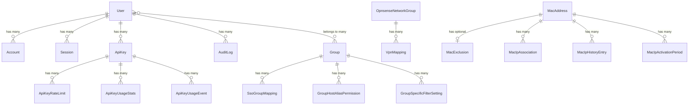

# Database Schema Reference

[⬆️ Back to Documentation Home](../DOCUMENTATION_INDEX.md) | [📁 Back to Configuration](./CONFIGURATION_INDEX.md)

## Overview

This document provides a comprehensive reference for the InstradaOGM database schema. It covers all database tables, their purposes, relationships, and common usage patterns. This reference is designed for administrators, developers, and advanced users who need to understand the data model.

## Table of Contents

- [Authentication & User Management](#authentication--user-management)
  - [User](#user)
  - [Account](#account)
  - [Session](#session)
  - [VerificationToken](#verificationtoken)
- [Group & Permission Management](#group--permission-management)
  - [Group](#group)
  - [SsoGroupMapping](#ssogroupmapping)
  - [GroupFilterSetting](#groupfiltersetting)
  - [GroupSpecificFilterSetting](#groupspecificfiltersetting)
  - [GroupHostAliasPermission](#grouphostaliaspermission)
- [Network Group Management](#network-group-management)
  - [OpnsenseNetworkGroup](#opnsensenetworkgroup)
  - [OpnsenseGroupDisplay](#opnsensegroupdisplay)
  - [GloballyDisabledGroup](#globallydisabledgroup)
  - [NetworkAliasDisplaySettings](#networkaliasdisplaysettings)
  - [ValidLocalNetwork](#validlocalnetwork)
- [VPN Management](#vpn-management)
  - [VpnMapping](#vpnmapping)
- [System Configuration](#system-configuration)
  - [GlobalSettings](#globalsettings)
- [Audit & Analytics](#audit--analytics)
  - [AuditLog](#auditlog)
  - [ApiKey](#apikey)
  - [ApiKeyRateLimit](#apikeyratelimit)
  - [ApiKeyUsageStats](#apikeyusagestats)
  - [ApiKeyUsageEvent](#apikeyusageevent)
  - [SessionUsageStats](#sessionusagestats)
  - [SessionUsageEvent](#sessionusageevent)
- [MAC Address Tracking](#mac-address-tracking)
  - [MacAddress](#macaddress)
  - [MacIpAssociation](#macipassociation)
  - [MacExclusion](#macexclusion)
  - [MacIpHistoryEntry](#maciphistoryentry)
  - [MacIpActivationPeriod](#macipactivationperiod)
- [Schedule System](#schedule-system)
  - [ScheduledAssignment](#scheduledassignment)
  - [ScheduleDay](#scheduleday)
  - [TimeWindow](#timewindow)
  - [ScheduleAction](#scheduleaction)
  - [ScheduleExecution](#scheduleexecution)
- [Database Relationships](#database-relationships)
- [Common Query Patterns](#common-query-patterns)

---

## Authentication & User Management

### User

**Purpose**: Stores user account information including authentication credentials, roles, and security settings.

**Key Fields**:
- `id` - Unique user identifier (CUID)
- `username` - Unique username for local authentication
- `email` - User email address (unique)
- `password` - Hashed password for local authentication
- `role` - User role: `USER`, `ADMIN`, or `SUPER_ADMIN`
- `is2FAEnabled` - Two-factor authentication status
- `totpSecret` - TOTP secret for 2FA
- `backupCodes` - Encrypted backup codes for 2FA recovery
- `mustChangePassword` - Forces password change on next login
- `lastActive` - Last activity timestamp

**Relationships**:
- Has many `Account` records (SSO providers)
- Has many `Session` records (active sessions)
- Has many `ApiKey` records (API keys)
- Has many `AuditLog` records (audit trail)
- Belongs to many `Group` records (permission groups)

**Use Cases**:
- Local and SSO authentication
- Role-based access control
- Two-factor authentication with backup codes
- Password management and forced resets
- User activity tracking

---

### Account

**Purpose**: Links user accounts to external OAuth/SSO providers (Authentik, Microsoft Entra ID, Keycloak).

**Key Fields**:
- `userId` - Reference to User table
- `provider` - SSO provider name (e.g., "authentik", "microsoft")
- `providerAccountId` - User ID from the SSO provider
- `access_token` - OAuth access token
- `refresh_token` - OAuth refresh token
- `externalGroups` - JSON array of SSO groups user belongs to

**Relationships**:
- Belongs to `User`

**Use Cases**:
- SSO authentication integration
- External group synchronization
- OAuth token management
- Multi-provider support per user

---

### Session

**Purpose**: Manages active user sessions for authentication and session tracking.

**Key Fields**:
- `sessionToken` - Unique session identifier
- `userId` - Reference to User table
- `expires` - Session expiration timestamp

**Relationships**:
- Belongs to `User`

**Use Cases**:
- Session-based authentication
- Automatic session expiration
- Session analytics and tracking

---

### VerificationToken

**Purpose**: Stores temporary tokens for email verification and password reset operations.

**Key Fields**:
- `identifier` - Email address or user identifier
- `token` - Unique verification token
- `expires` - Token expiration timestamp

**Use Cases**:
- Email verification for new accounts
- Password reset workflows
- Secure token-based operations

---

## Group & Permission Management

### Group

**Purpose**: Local user groups for managing device access permissions and SSO group mappings.

**Key Fields**:
- `name` - Unique group name
- `description` - Group description
- `permissionsLastModified` - Timestamp of last permission change

**Relationships**:
- Has many `GroupHostAliasPermission` records (device permissions)
- Has many `GroupSpecificFilterSetting` records (network group filters)
- Has many `SsoGroupMapping` records (SSO mappings)
- Has many `User` records (group members)

**Use Cases**:
- Device access control
- SSO group mapping
- Permission management
- User organization

---

### SsoGroupMapping

**Purpose**: Maps external SSO provider groups to local InstradaOGM groups for automatic permission assignment.

**Key Fields**:
- `ssoProvider` - SSO provider name (e.g., "authentik")
- `ssoGroupName` - External group name from SSO provider
- `localGroupId` - Reference to local Group

**Relationships**:
- Belongs to `Group`

**Use Cases**:
- Automatic group assignment on SSO login
- Synchronize external group memberships
- Multi-provider group mapping

---

### GroupFilterSetting

**Purpose**: Global filters that control network group visibility for all users based on role.

**Key Fields**:
- `pattern` - Regex pattern or group UUID to filter
- `type` - Filter type: `SHOW_ONLY`, `HIDE`, `ROLE_BASED`
- `description` - Filter description

**Use Cases**:
- Hide administrative groups from regular users
- Show only specific groups to certain roles
- Global network group visibility control

---

### GroupSpecificFilterSetting

**Purpose**: Group-specific filters that control which network groups members of a local group can see.

**Key Fields**:
- `groupId` - Reference to local Group
- `pattern` - Regex pattern or group UUID to filter
- `type` - Filter type: `SHOW_ONLY`, `HIDE`
- `description` - Filter description

**Relationships**:
- Belongs to `Group`

**Use Cases**:
- Restrict network group visibility per local group
- Create custom views for different teams
- Fine-grained access control

---

### GroupHostAliasPermission

**Purpose**: Grants local groups permission to manage specific devices (OPNsense host aliases).

**Key Fields**:
- `groupId` - Reference to local Group
- `opnsenseAliasUuid` - OPNsense host alias UUID

**Relationships**:
- Belongs to `Group`

**Use Cases**:
- Device-level access control
- Team-based device management
- Permission delegation

---

## Network Group Management

### OpnsenseNetworkGroup

**Purpose**: Represents OPNsense firewall network groups that control device network access.

**Key Fields**:
- `id` - OPNsense group UUID
- `name` - OPNsense group name
- `description` - Group description from OPNsense

**Relationships**:
- Has many `VpnMapping` records (VPN associations)

**Use Cases**:
- Network access control
- Firewall rule management
- Device group assignments

---

### OpnsenseGroupDisplay

**Purpose**: Stores friendly names, icons, and group type settings for OPNsense network groups.

**Key Fields**:
- `opnsenseUuid` - Reference to OPNsense group UUID
- `friendlyName` - User-friendly display name
- `iconIdentifier` - Icon identifier (Lucide icon, emoji, or flag)
- `groupType` - Group behavior: `SingleSelect` or `MultiSelect`

**Use Cases**:
- Custom group branding
- SingleSelect vs MultiSelect behavior
- User-friendly interface
- Visual group identification

---

### GloballyDisabledGroup

**Purpose**: Network groups that are completely hidden from all users across the application.

**Key Fields**:
- `opnsenseUuid` - Reference to OPNsense group UUID

**Use Cases**:
- Hide administrative groups
- Disable deprecated groups
- System-level group management

---

### NetworkAliasDisplaySettings

**Purpose**: Local overlay storage for network alias visibility state. Stores whether individual network aliases should be hidden from management interfaces.

**Key Fields**:
- `opnsenseAliasUuid` - Unique reference to OPNsense network alias UUID
- `hidden` - Boolean flag; when true, alias is excluded from all management interfaces

**Relationships**:
- One-to-one mapping with network aliases in OPNsense (by UUID)

**Default Values**:
- `hidden` - false (aliases are visible by default)

**Cascade Behavior**:
- Records are deleted when their corresponding alias is deleted in OPNsense

**Use Cases**:
- Hide sensitive or special-use network aliases
- Prevent accidental assignment of critical network ranges
- Manage large alias collections by hiding deprecated entries
- Protect aliases that should only be managed directly in OPNsense

**Important Notes**:
- **Aliases cannot be assigned while hidden** - Any API or UI attempt to assign a hidden alias to a group will be rejected with a 403 error
- **Existing assignments protected** - Hidden aliases already assigned to groups will not be reassigned, only evicted from SingleSelect groups if a non-hidden alias is assigned to that group
- **Admin-visible** - The Network Management admin table still displays hidden aliases with a "Hidden" badge
- **Filtering applied server-side** - User-facing APIs automatically exclude hidden aliases from results

**Migration & Cleanup**:
- Records are automatically created/updated when the hidden flag is changed via the API
- Orphaned records (with non-existent OPNsense UUIDs) can be cleaned up periodically
- Index on `opnsenseAliasUuid` enables fast lookups during assignment operations

---

### ValidLocalNetwork

**Purpose**: Defines allowed IP ranges for self-service access and network validation.

**Key Fields**:
- `network` - CIDR network (e.g., "192.168.1.0/24")
- `startIp` - Start IP for range-based validation
- `endIp` - End IP for range-based validation
- `type` - Network type: `CIDR`, `RANGE`, or `SINGLE`
- `description` - Network description

**Use Cases**:
- Self-service IP validation
- Restrict self-service to specific networks
- Network access control

---

## VPN Management

### VpnMapping

**Purpose**: Maps VPN connections (OpenVPN, WireGuard, IPsec) to network groups for automatic routing.

**Key Fields**:
- `vpnUuid` - OPNsense VPN connection UUID
- `vpnName` - VPN connection name from OPNsense
- `vpnClient` - VPN type: `OpenVPN`, `WireGuard`, or `IPsec`
- `friendlyName` - User-friendly VPN name
- `opnsenseNetworkGroupId` - Reference to OpnsenseNetworkGroup

**Relationships**:
- Belongs to `OpnsenseNetworkGroup`

**Use Cases**:
- VPN status monitoring
- Automatic VPN routing based on group membership
- VPN connection display

---

## System Configuration

### GlobalSettings

**Purpose**: Application-wide configuration settings stored as a single record.

**Key Fields**:
- `enableRegistration` - Allow new user registration
- `enableRenamingSelfServicePage` - Allow device renaming in self-service
- `enableRenamingDeviceManagementPage` - Allow device renaming in device management
- `allowedNetworks` - JSON array of allowed networks for self-service
- `customLucideIcons` - JSON array of custom Lucide icons
- `customEmojis` - JSON array of custom emojis
- `customFlags` - JSON array of custom flag emojis
- `enableGroupTypes` - Enable SingleSelect/MultiSelect group types
- `enableSelfServiceMultiSelect` - Allow MultiSelect in self-service
- `singleSelectName` - Display name for SingleSelect groups
- `multiSelectName` - Display name for MultiSelect groups
- `singleSelectIcon` - Icon for SingleSelect groups
- `multiSelectIcon` - Icon for MultiSelect groups
- `enableAdvancedAnalytics` - Enable detailed analytics tracking
- `logsAnalyticsRetentionDays` - Analytics data retention period (days)
- `removeSelfServicePage` - Completely disable self-service functionality
- `enableMacTracking` - Enable MAC address tracking feature
- `macTrackingInterval` - MAC tracking scan interval (minutes)
- `macInactiveTimeout` - Minutes before marking MAC inactive
- `macDataRetentionDays` - MAC tracking data retention (days)
- `enableApplicationSubtitle` - Show custom subtitle in header
- `subtitleText` - Custom subtitle text
- `enableLoginPageSubtitle` - Show subtitle on login page
- `enableMacExclusions` - Enable MAC exclusion feature
- `macExclusionRetentionDays` - MAC exclusion data retention (days)

**Use Cases**:
- Application configuration
- Feature toggles
- Retention policies
- Branding customization

---

## Audit & Analytics

### AuditLog

**Purpose**: Comprehensive audit trail for all system operations and user actions.

**Key Fields**:
- `timestamp` - When the action occurred
- `userId` - User who performed the action (null for system actions)
- `action` - Action type (e.g., "USER_LOGIN", "DEVICE_MOVED")
- `details` - JSON object with action-specific details

**Relationships**:
- Belongs to `User` (optional)

**Use Cases**:
- Security auditing
- Compliance reporting
- User activity tracking
- Troubleshooting

---

### ApiKey

**Purpose**: API key management with rate limiting and usage tracking.

**Key Fields**:
- `name` - API key name/description
- `keyHash` - Hashed API key value
- `userId` - Reference to User who owns the key
- `enabled` - Whether the key is active
- `expiresAt` - Optional expiration date
- `hourlyLimit` - Hourly request limit
- `dailyLimit` - Daily request limit
- `monthlyLimit` - Monthly request limit
- `burstLimit` - Burst request limit
- `lastUsed` - Last usage timestamp

**Relationships**:
- Belongs to `User`
- Has many `ApiKeyRateLimit` records
- Has many `ApiKeyUsageStats` records
- Has many `ApiKeyUsageEvent` records

**Use Cases**:
- API authentication
- Rate limiting
- Usage tracking
- Automation integration

---

### ApiKeyRateLimit

**Purpose**: Tracks API key rate limiting windows (hourly, daily, monthly, burst).

**Key Fields**:
- `apiKeyId` - Reference to ApiKey
- `windowType` - Window type: `HOURLY`, `DAILY`, `MONTHLY`, `BURST`
- `windowStart` - Window start timestamp
- `requestCount` - Number of requests in this window
- `lastRequest` - Last request timestamp

**Relationships**:
- Belongs to `ApiKey`

**Use Cases**:
- Rate limit enforcement
- Request counting
- Abuse prevention

---

### ApiKeyUsageStats

**Purpose**: Daily aggregated statistics for API key usage.

**Key Fields**:
- `apiKeyId` - Reference to ApiKey
- `date` - Statistics date
- `totalRequests` - Total requests for the day
- `successfulRequests` - Successful requests
- `failedRequests` - Failed requests
- `rateLimitHits` - Number of rate limit hits
- `uniqueEndpoints` - Number of unique endpoints accessed
- `avgResponseTime` - Average response time (ms)
- `peakHourlyUsage` - Peak requests in any hour
- `topEndpoints` - JSON array of most-used endpoints
- `topIpAddresses` - JSON array of top IP addresses
- `errorsByType` - JSON object of errors by type
- `usageByHour` - JSON array of hourly usage

**Relationships**:
- Belongs to `ApiKey`

**Use Cases**:
- Usage analytics
- Performance monitoring
- Capacity planning
- Billing/metering

---

### ApiKeyUsageEvent

**Purpose**: Individual API request events for detailed tracking.

**Key Fields**:
- `apiKeyId` - Reference to ApiKey
- `timestamp` - Request timestamp
- `endpoint` - API endpoint accessed
- `method` - HTTP method (GET, POST, etc.)
- `statusCode` - HTTP status code
- `responseTime` - Response time (ms)
- `ipAddress` - Client IP address
- `userAgent` - Client user agent
- `requestSize` - Request size (bytes)
- `responseSize` - Response size (bytes)
- `errorType` - Error type if failed
- `rateLimitHit` - Whether rate limit was hit

**Relationships**:
- Belongs to `ApiKey`

**Use Cases**:
- Detailed request logging
- Debugging
- Performance analysis
- Security monitoring

---

### SessionUsageStats

**Purpose**: Daily aggregated statistics for user session activity.

**Key Fields**:
- `sessionToken` - Session identifier
- `userId` - Reference to User (optional)
- `date` - Statistics date
- `totalRequests` - Total requests for the day
- `apiCalls` - API calls
- `pageViews` - Page views
- `uiActions` - UI interactions
- `successfulRequests` - Successful requests
- `failedRequests` - Failed requests
- `avgResponseTime` - Average response time (ms)
- `topEndpoints` - JSON array of most-used endpoints
- `topPages` - JSON array of most-viewed pages
- `actionsByType` - JSON object of actions by type
- `usageByHour` - JSON array of hourly usage

**Relationships**:
- Belongs to `User` (optional)

**Use Cases**:
- User activity analytics
- Performance monitoring
- Feature usage tracking
- User behavior analysis

---

### SessionUsageEvent

**Purpose**: Individual session events for detailed user activity tracking.

**Key Fields**:
- `sessionToken` - Session identifier
- `userId` - Reference to User (optional)
- `timestamp` - Event timestamp
- `endpoint` - API endpoint or page URL
- `method` - HTTP method
- `actionType` - Action type: `API_CALL`, `PAGE_VIEW`, `UI_ACTION`
- `statusCode` - HTTP status code
- `responseTime` - Response time (ms)
- `ipAddress` - Client IP address
- `pageUrl` - Page URL for page views
- `metadata` - JSON object with event-specific data

**Relationships**:
- Belongs to `User` (optional)

**Use Cases**:
- Detailed activity logging
- User journey tracking
- Performance analysis
- Security monitoring

---

## MAC Address Tracking

### MacAddress

**Purpose**: Core table storing unique MAC addresses detected on the network.

**Key Fields**:
- `macAddress` - Normalized MAC address (lowercase, no separators)
- `vendor` - MAC vendor from OUI lookup
- `deviceName` - Hostname from ARP or DHCP
- `isActive` - Whether MAC has been seen recently
- `isPrivacyMac` - Whether MAC is randomized/privacy MAC
- `firstSeen` - First detection timestamp
- `lastSeen` - Last detection timestamp

**Relationships**:
- Has one `MacExclusion` (optional)
- Has many `MacIpAssociation` records
- Has many `MacIpHistoryEntry` records
- Has many `MacIpActivationPeriod` records

**Use Cases**:
- Network device discovery
- Device tracking
- Privacy MAC detection
- Vendor identification

---

### MacIpAssociation

**Purpose**: Tracks current and historical IP address associations for MAC addresses. Supports multiple simultaneous IPs.

**Key Fields**:
- `macAddressId` - Reference to MacAddress
- `ipAddress` - Associated IP address
- `networkInterface` - Network interface (e.g., "igb0", "vlan10")
- `isActive` - Whether this association is currently active
- `isDhcpReserved` - Whether MAC/IP has DHCP reservation
- `hasDhcpConflict` - Whether there's a DHCP conflict
- `firstSeen` - First time this MAC/IP combo was seen
- `lastSeen` - Last time this MAC/IP combo was seen

**Relationships**:
- Belongs to `MacAddress`

**Use Cases**:
- Current IP tracking
- Multi-IP support (keepalived, HA clusters)
- DHCP reservation tracking
- Conflict detection

---

### MacExclusion

**Purpose**: Manages MAC addresses excluded from tracking with FULL or PARTIAL modes.

**Key Fields**:
- `macAddressId` - Reference to MacAddress
- `enabled` - Whether exclusion is active
- `exclusionMode` - `FULL` (skip completely) or `PARTIAL` (track IPs, skip history)
- `reason` - User-provided exclusion reason
- `excludedBy` - User ID who created exclusion
- `lastModifiedBy` - User ID who last modified

**Relationships**:
- Belongs to `MacAddress`

**Use Cases**:
- Exclude infrastructure devices
- Reduce database growth
- Filter unwanted MACs
- Protocol MAC exclusion (VRRP, HSRP)

---

### MacIpHistoryEntry

**Purpose**: Aggregated historical IP detection data for non-excluded MAC addresses.

**Key Fields**:
- `macAddressId` - Reference to MacAddress
- `ipAddress` - Historical IP address
- `networkInterface` - Network interface
- `detectionCount` - Number of times this MAC/IP combo was detected
- `firstSeen` - First detection
- `lastSeen` - Last detection

**Relationships**:
- Belongs to `MacAddress`

**Use Cases**:
- Historical IP tracking
- Detection counting
- Network behavior analysis
- Full history display

---

### MacIpActivationPeriod

**Purpose**: Tracks discrete periods when a MAC was associated with specific IPs for timeline visualization.

**Key Fields**:
- `macAddressId` - Reference to MacAddress
- `ipAddress` - IP address for this period
- `networkInterface` - Network interface
- `hostname` - Device hostname at activation
- `hostAlias` - OPNsense host alias at activation
- `activatedAt` - When this IP became active
- `deactivatedAt` - When this IP was deactivated (null if still active)

**Relationships**:
- Belongs to `MacAddress`

**Use Cases**:
- Timeline visualization
- History consolidation
- IP change tracking
- Full history modal display

---

## Schedule System

### ScheduledAssignment

**Purpose**: Master record defining a schedule configuration.

**Key Fields**:
- `id` - Unique identifier
- `name` - Schedule name
- `description` - Optional description
- `enabled` - Boolean toggle for execution
- `priority` - Execution priority (higher resolves conflicts)
- `scheduleType` - Mode: `COMPLEX_WEEKLY`, `ONCE`, or `RECURRING`
- `timezone` - IANA timezone database identifier
- `targetType` - Resolution technique (`IP_LIST`, `HOST_ALIAS`, `NETWORK_GROUP`)
- `targetSelector` - JSON resolving payload

**Relationships**:
- Has many `ScheduleDay` records (if Complex Weekly)
- Has many `ScheduleAction` records (if Once or Recurring)
- Has many `ScheduleExecution` records (Audit log execution history)

**Use Cases**:
- Complex daily patterns
- Single time-based execution mapping
- Recurring cron rule mapping

---

### ScheduleDay

**Purpose**: Defines a single day within a Complex Weekly pattern.

**Key Fields**:
- `id` - Unique identifier
- `scheduleId` - Link to ScheduledAssignment
- `dayOfWeek` - Integer representation of the day (0 = Sun, 6 = Sat)

**Relationships**:
- Belongs to `ScheduledAssignment`
- Has many `TimeWindow` records

---

### TimeWindow

**Purpose**: Discrete duration block within a day, establishing `START` and `END` boundaries.

**Key Fields**:
- `id` - Unique identifier
- `scheduleDayId` - Link to ScheduleDay
- `startTime` - 24-hour HH:MM format boundary start
- `endTime` - 24-hour HH:MM format boundary end
- `label` - Human-readable label

**Relationships**:
- Belongs to `ScheduleDay`
- Has many `ScheduleAction` records

---

### ScheduleAction

**Purpose**: Specifies the action operation applied at a given boundary logic point.

**Key Fields**:
- `id` - Unique identifier
- `operation` - Type: `ASSIGN`, `REMOVE`, `MOVE`, `CLEAR_ALL`
- `boundaryType` - Execution anchor (`START` or `END`)
- `targetGroupUuid` - OPNsense Network Group UUID referencing target
- `fromGroupUuid` - Optional source mapping for MOVE operations
- `sortOrder` - Priority sequence integer logic

**Relationships**:
- Belongs to `TimeWindow`, `ScheduledAssignment` (OnceActions), or `ScheduledAssignment` (RecurringActions)

---

### ScheduleExecution

**Purpose**: Detailed audit telemetry recording boundary operations.

**Key Fields**:
- `id` - Unique log execution identifier
- `scheduleId` - Link to ScheduledAssignment
- `boundaryType` - Boundary fired (`START`, `END`, `ONCE`, `RECURRING`)
- `executedAt` - Execution UTC Timestamp
- `status` - Operation success tracker (`SUCCESS`, `PARTIAL`, `FAILED`, `SKIPPED`)
- `targetIps` - JSON array of dynamically resolved IPs at execution time
- `actionsRun` - JSON array of operational logic steps applied

**Relationships**:
- Belongs to `ScheduledAssignment`

---

## Database Relationships



---

## Common Query Patterns

### User Authentication
```typescript
// Find user with accounts and groups
const user = await prisma.user.findUnique({
  where: { email: 'user@example.com' },
  include: {
    accounts: true,
    groups: {
      include: {
        hostAliasPermissions: true
      }
    }
  }
});
```

### Device Permissions
```typescript
// Get all devices a user can manage
const userGroups = await prisma.group.findMany({
  where: {
    users: {
      some: { id: userId }
    }
  },
  include: {
    hostAliasPermissions: true
  }
});
```

### MAC Address Tracking
```typescript
// Get MAC with all active IPs
const mac = await prisma.macAddress.findUnique({
  where: { macAddress: 'aa:bb:cc:dd:ee:ff' },
  include: {
    ipAssociations: {
      where: { isActive: true }
    },
    exclusion: true
  }
});
```

### API Key Usage
```typescript
// Get API key with today's stats
const apiKey = await prisma.apiKey.findUnique({
  where: { id: keyId },
  include: {
    usageStats: {
      where: {
        date: {
          gte: startOfDay(new Date()),
          lte: endOfDay(new Date())
        }
      }
    }
  }
});
```

### Audit Trail
```typescript
// Get recent audit logs for a user
const logs = await prisma.auditLog.findMany({
  where: { userId: userId },
  orderBy: { timestamp: 'desc' },
  take: 100
});
```

---

## Best Practices

### Performance
- Use indexes for frequently queried fields
- Implement pagination for large result sets
- Use `select` to limit returned fields
- Cache frequently accessed data (e.g., GlobalSettings)

### Data Integrity
- Use transactions for multi-table operations
- Leverage cascade deletes for related records
- Validate data before database operations
- Use unique constraints to prevent duplicates

### Security
- Hash sensitive data (passwords, API keys)
- Encrypt backup codes and secrets
- Audit all sensitive operations
- Implement rate limiting for API access

### Maintenance
- Regular cleanup of old audit logs and analytics
- Monitor database size and growth
- Archive historical data as needed
- Keep retention policies up to date

---

## Related Documentation

- [MAC Address Tracking](../FEATURES/MAC_ADDRESS_TRACKING.md) - Comprehensive MAC tracking feature guide
- [Backup Management](../FEATURES/BACKUP_MANAGEMENT.md) - Database backup and restore
- [API Documentation](../api/) - Complete API endpoint reference
- [Prisma Migration Guide](./PRISMA_MIGRATION_GUIDE.md) - Database migration procedures
- [Sample Database Queries](./SAMPLE_DATABASE_QUERIES.md) - Example queries and patterns
